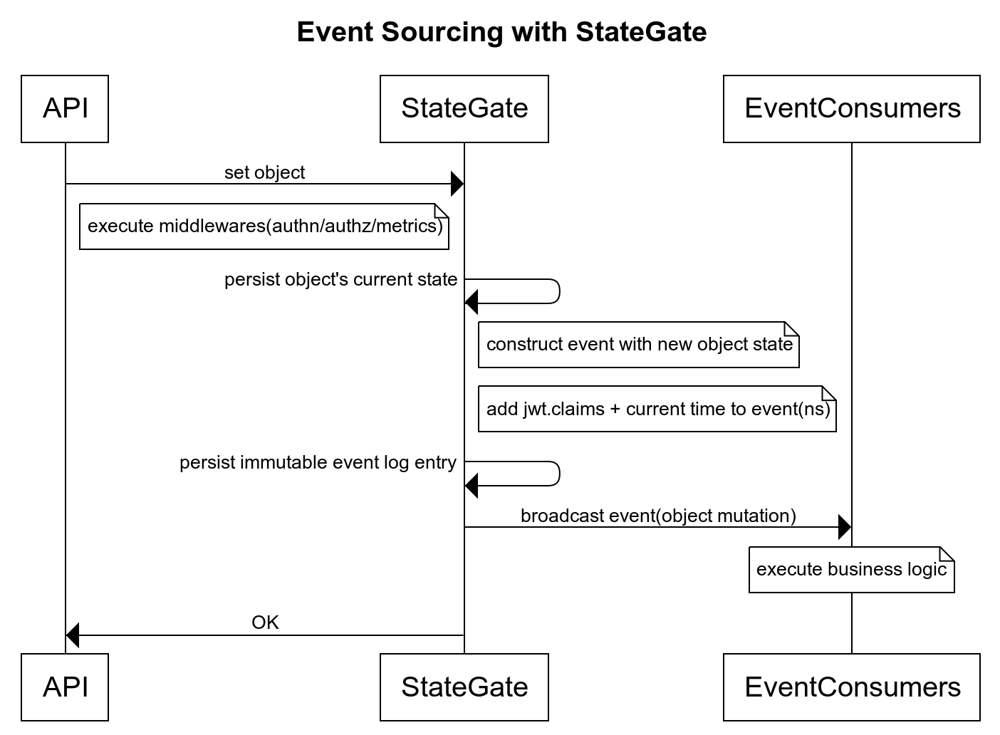

# stategate

A pluggable API and "Application State Gateway" that enforces the [Event Sourcing Pattern](https://microservices.io/patterns/data/event-sourcing.html) for securely persisting & broadcasting application state changes




[](https://godoc.org/github.com/autom8ter/stategate/stategate-client-go)

- [API Documentation](https://autom8ter.github.io/stategate/)
                                        
## Features
- [x] [5 simple API Methods](https://github.com/autom8ter/stategate/blob/master/schema.proto#L15) for interacting with application state: `SetObject, GetObject, SearchObjects, StreamEvents, SearchEvents`
- [x] Capture all changes to an application's state as a sequence of events.
- [x] Stateless & horizontally scaleable
- [x] Native [gRPC](https://grpc.io/) support
    - [protobuf schema](schema.proto)
- [x] Embedded REST support `/` (transcoding)
    - [open api schema](schema.swagger.json)
- [x] Embedded [grpcweb](https://grpc.io/docs/platforms/web/basics/) support (transcoding)
- [x] Metrics Server(prometheus/pprof)
- [x] Authentication - JWT/OAuth with remote [JWKS](https://auth0.com/docs/tokens/json-web-tokens/json-web-key-sets) verification
- [x] Authorization - [Rego](https://www.openpolicyagent.org/docs/latest/policy-language/) based Authorization engine
- [x] Autogenerated Client gRPC SDK's
    - [x] Go
        - [](https://godoc.org/github.com/autom8ter/stategate/stategate-client-go)
    - [x] [Node](./gen/grpc/node)
    - [x] [PHP](./gen/grpc/php)
    - [x] [C#](./gen/grpc/csharp)
    - [x] [Java](./gen/grpc/java)
    - [x] [gRPC Web](./gen/grpc/web)
    - [ ] Python
    - [ ] Ruby
- [x] Structured JSON Logs
- [x] [Sample Kubernetes Manifest](k8s.yaml)
- [x] [Sample Docker Compose](docker-compose.yml)
- [x] Pluggable "Channel" Providers
    - [x] In-Memory(won't scale horizontally)
        - [x] fully-tested
    - [x] Nats
         - [x] fully-tested
    - [x] Nats Streaming(Stan)
    - [x] Redis
         - [x] fully-tested
    - [x] Kafka
    - [ ] RabbitMQ

- [x] Pluggable "Storage" Providers
    - [x] MongoDb
        - [x] fully-tested
    - [ ] PostgreSQL
    - [ ] MySQL
    - [ ] Cassandra


## Goals

- [x] Create a simple API interface for storing state and subscribing to state changes(events) using pluggable channel & storage providers
- [x] Capture all changes to an application's state as a sequence of events.
- [x] Safe to swap backend providers without changing client-side code
- [x] Type-safe client's generated in many languages
- [x] Safe to expose to the public internet due to fine-grained authentication/authorization model.
- [x] Different combinations of Channel & Storage Providers are interoperable.
- [x] Capture a persistant, immutable historical record of all state changes using a pluggable storage provider
- [x] Store identity(jwt.claims) & timestamp in event logs to capture who is changing what & when
- [x] Easy deployment model - fully configureable via environmental variables

## Concepts

- Storage Provider: A stategate storage provider is a pluggable, 3rd party database storage service. Storage providers
provide persistance for all objects & events and should be scaled independently of stategate instances.


- Channel Provider: A stategate channel provider is a pluggable, 3rd party message-queue/channel service. Channel providers
provide a way for stategate to broadcast events to itself while scaling horizontally. Channel providers should be scaled independently of stategate instances.


## Environmental Variables

```yaml
# port to serve on (optional). defaults to 8080
STATEGATE_PORT=8080
# enable debug logs (optional)
STATEGATE_DEBUG=true
# disable all authentication & authorization(jwks, request policies, response policies) (optional)
STATEGATE_AUTH_DISABLED=false
# tls cert file (optional)
STATEGATE_TLS_CERT_FILE=/tmp/certs/stategate.cert
# tls key file (optional)
STATEGATE_TLS_KEY_FILE=/tmp/certs/stategate.key

# JSON Web Key Set remote URI used for fetching jwt signing keys for verification/validation (optional)
STATEGATE_JWKS_URI=https://www.googleapis.com/oauth2/v3/certs

# base64 encoded OPA rego policy executed on inbound requests from clients (optional)
STATEGATE_REQUEST_POLICY=cGFja2FnZSBzdGF0ZWdhdGUuYXV0aHoKCmRlZmF1bHQgYWxsb3cgPSB0cnVl
# base64 encoded OPA rego policy executed on responses sent to clients (optional)
STATEGATE_RESPONSE_POLICY=cGFja2FnZSBzdGF0ZWdhdGUuYXV0aHoKCmRlZmF1bHQgYWxsb3cgPSB0cnVl
# channel provider configuration(JSON) options: [inmem, redis, nats, stan, kafka] REQUIRED
STATEGATE_CHANNEL_PROVIDER={ "name": "redis", "addr": "localhost:6379" }
# STATEGATE_CHANNEL_PROVIDER={ "name": "nats", "addr": "localhost:4222" }
# STATEGATE_CHANNEL_PROVIDER={ "name": "stan", "addr": "localhost:4222" }
# STATEGATE_CHANNEL_PROVIDER={ "name": "inmem" }

# storage provider configuration(JSON) options: [mongo] REQUIRED
STATEGATE_STORAGE_PROVIDER={ "name": "mongo", "database": "testing", "addr": "mongodb://localhost:27017/testing" }


```

## Notes
